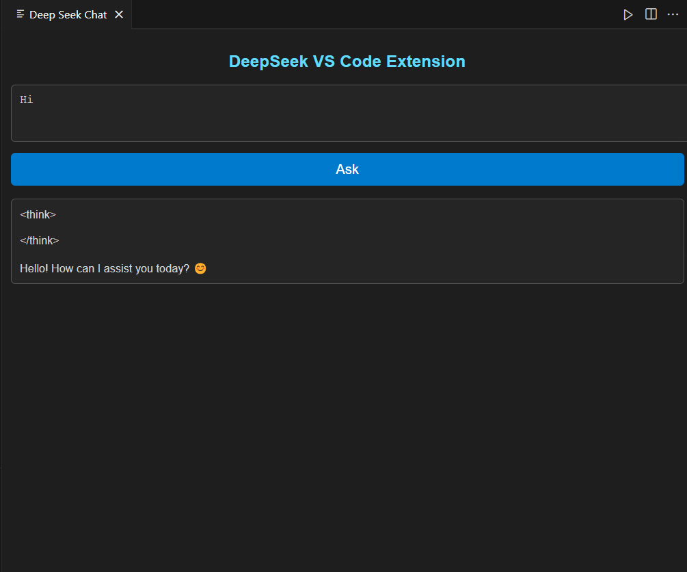

# DeepSeek VS Code Extension (Powered by Ollama)

## Overview
The **DeepSeek VS Code Extension** enables developers to interact with DeepSeek AI directly from their VS Code environment. This extension leverages **Ollama** for powerful AI-based responses, making it easier to generate code, get explanations, and automate tasks within the editor.



## Features
- 🚀 **Send AI Prompts**: Quickly enter and send prompts to DeepSeek AI.
- 💡 **Receive AI Responses**: Get instant answers displayed within the extension panel.
- 🎨 **Dark Theme Support**: Designed to blend seamlessly with VS Code's dark mode.
- 🔗 **VS Code Integration**: Uses `acquireVsCodeApi()` for smooth communication.
- 🤖 **Powered by Ollama**: Utilizes Ollama's AI capabilities to generate intelligent responses.

## Installation
1. **Clone the Repository**
   ```sh
   git clone https://github.com/axitchandora/VS-DeepSeek-Ext.git
   cd VS-DeepSeek-Ext
   ```
2. **Install Dependencies** (if applicable)
   ```sh
   npm install
   ```
3. **Run in VS Code**
   - Open the project in VS Code.
   - Press `F5` to launch the extension in a new VS Code window.

## Usage
1. Open the **DeepSeek Panel** from the **VS Code sidebar**.
2. Enter a **prompt** in the textarea.
3. Click **"Ask"** to send the prompt to DeepSeek AI.
4. View the **AI-generated response** inside the response box.

## How It Works
- The extension creates a webview panel inside VS Code.
- The user enters a prompt and clicks "Ask."
- The extension sends the prompt to **Ollama's DeepSeek model** using `ollama.chat()`.
- AI responses are streamed back and displayed inside the webview panel.

## Code Reference
The core functionality is implemented in the **extension.ts** file:
```typescript
panel.webview.onDidReceiveMessage(async (message: any) => {
    if (message.command === 'chat') {
        const userPrompt = message.text;
        let responseText = '';

        try {
            const streamResponse = await ollama.chat({
                model: 'deepseek-r1:1.5b',
                messages: [{ role: 'user', content: userPrompt }],
                stream: true
            });

            for await (const part of streamResponse) {
                responseText += part.message.content;
                panel.webview.postMessage({ command: 'chatResponse', text: responseText });
            }
        } catch (err) {
            panel.webview.postMessage({ command: 'chatResponse', text: `Error: ${String(err)}` });
        }
    }
});
```

## Requirements
- Visual Studio Code (Latest Version)
- Node.js & npm (for development)
- Ollama installed and configured

## Contributing
We welcome contributions! Follow these steps:
1. Fork the repository.
2. Create a new branch (`feature-branch`).
3. Commit your changes and push to GitHub.
4. Submit a Pull Request.

## License
This project is licensed under the **MIT License**.

## Support
For any issues, open a GitHub [issue](https://github.com/axitchandora/VS-DeepSeek-Ext/issues).

---
✨ **Enhance your VS Code experience with AI-powered assistance!** ✨